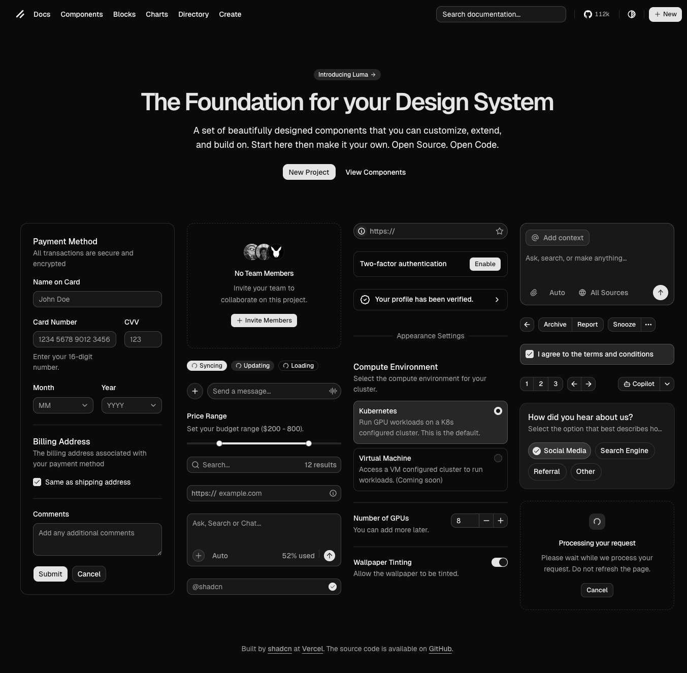
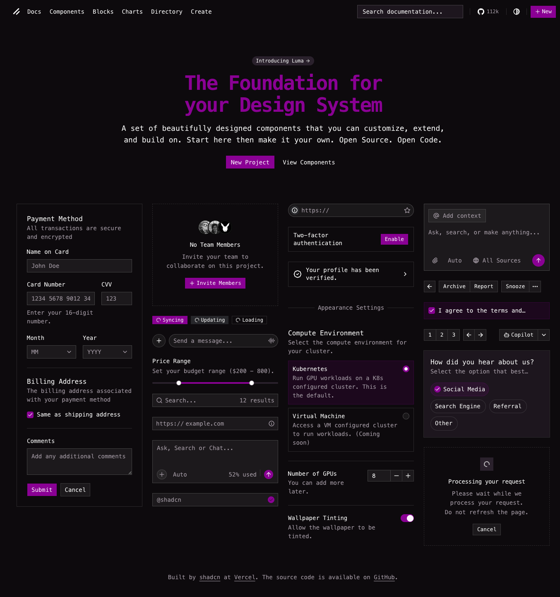

# shadcn-presets

Generate CSS variables from a [Shadcn](https://ui.shadcn.com) preset.

This package allows you to mimic the [Shadcn create page](https://ui.shadcn.com/create) by dynamically generating the CSS required to override your Shadcn CSS variables within a page.

## Extension

This project ships a [Chrome Extension](https://chromewebstore.google.com/detail/shadcn-preset-injector/llnebngamacamifijnaflamnjfejemhj?authuser=0&hl=en) to apply a preset to any website.

## Package Usage

```bash
npm i shadcn-presets
```

```ts
import { presetToShadcnThemeCss } from "shadcn-presets";

const theme = presetToShadcnThemeCss("b1ZjC5Fqt");

if (!theme) {
  throw new Error("Invalid preset value");
}

const { css, build } = theme;
// `build` is the registry theme object (`build.cssVars.light`, `build.name`, …) plus
// `build.fontSans` / `build.fontHeading` when those variables are emitted.

const INJECTED_STYLE_ID = "shadcn-presets";

let element = document.getElementById(INJECTED_STYLE_ID) as HTMLStyleElement | null;

// Create a new <style> element if it doesn't exist in your HTML
if (!element) {
  element = document.createElement("style");
  element.id = INJECTED_STYLE_ID;
}

// Inject the CSS variables into the page!
element.textContent = css;
```

## Fonts

Font support is a little nuanced. The `presetToShadcnThemeCss` function emits `--font-sans` and `--font-heading` on `:root` for the preset’s body and heading font ids. Whether those faces actually render depends on:

1. The font being loaded in your app (e.g. Google Fonts, `next/font`, self-hosted CSS).
2. The **family name** in the stack matching the `@font-face` / loader (see [font-families.ts](src/font-families.ts) for the built-in defaults, which assume variable fonts where applicable).

If the default stack does not match what your build registers (e.g. Google Fonts shows `font-family: "Figtree", sans-serif;` for a static build), pass the **value** only—no trailing semicolon; the serializer adds the rule terminator:

```ts
const { css, build } = presetToShadcnThemeCss("b1ZjC5Fqt", {
  figtree: `"Figtree", sans-serif`,
})!;
// build.fontSans reflects the resolved `--font-sans` stack
```

You can also pass overrides through `buildRegistryTheme` / `presetConfigToThemeBuildInput` via `fontFamilyOverrides` if you assemble the theme yourself.

## Example

Run the [example](/example) to see it in action:

```bash
cd example
bun install
bun run dev
```




## License

MIT. Theme data and behavior are aligned with [shadcn/ui](https://github.com/shadcn-ui/ui).
